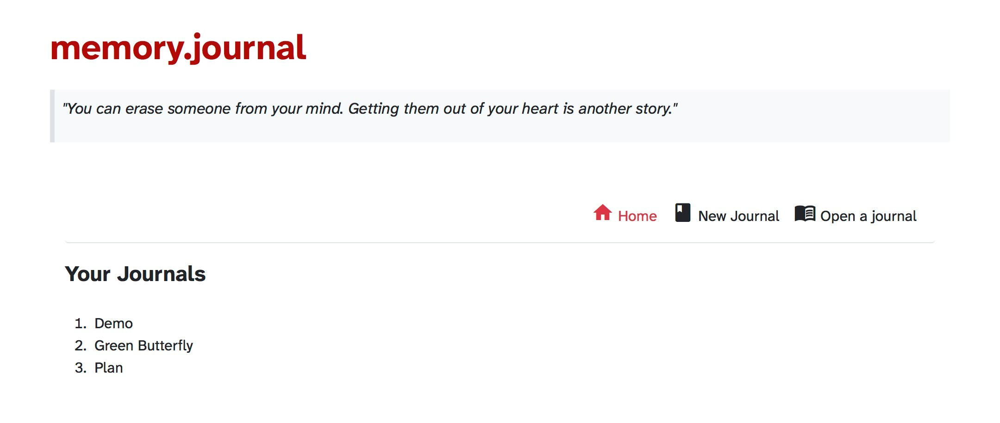
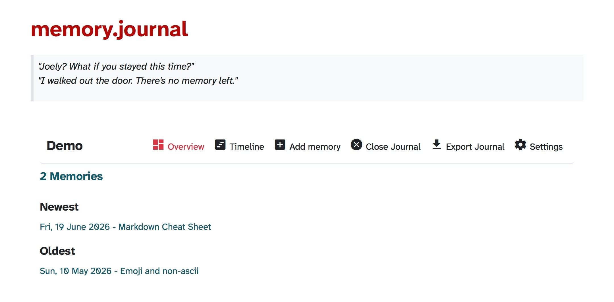
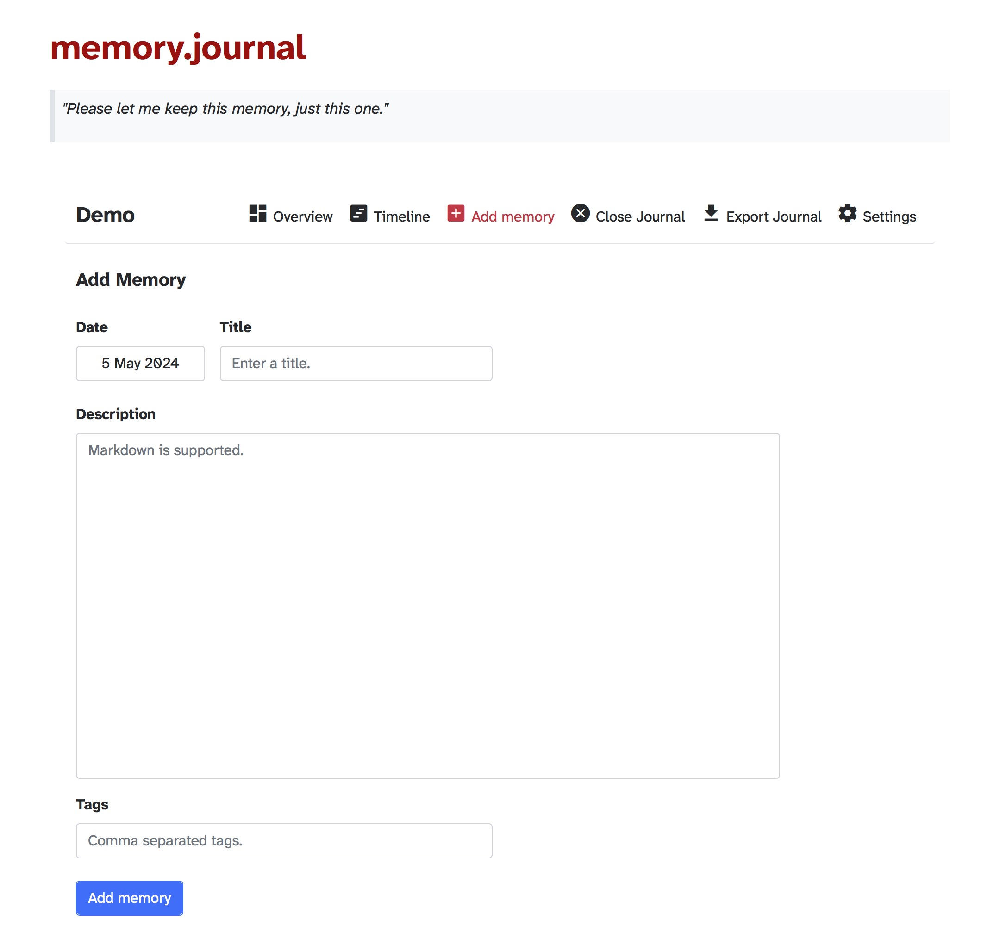
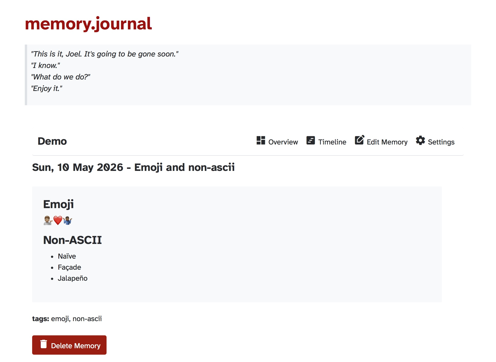
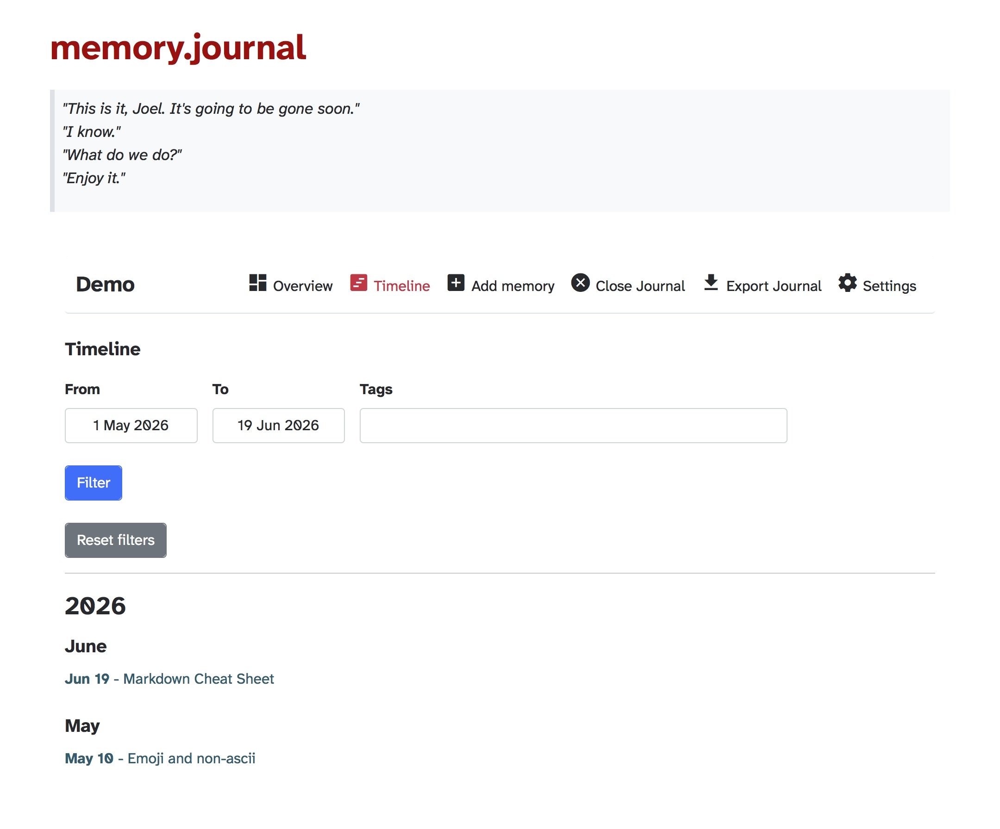

# memory.journal

[](https://www.python.org/)

[](LICENSE)

A lightweight, offline-first journaling app focused on privacy, simplicity, and long-term memory keeping.

*memory.journal* lets you jot down moments from any point in your life, be it today, or years ago. Every memory has its own date, separate from when you decide to write it down, helping you build your own little box of memories.


## Table of Contents

- [Features](#features)
- [Screenshots](#screenshots)
- [Installation](#installation)
- [Roadmap](#roadmap)
- [Development](#development)
- [License](#license)


## Features

- Simple and easy to use interface.
- Password protection for journals to keep memories safe.
- Markdown support for memories.
- Separate memory date from writing date.
- Export your journals to JSON format.

## Screenshots

### Home Page



### Journal Overview



### Add Memory



### View Memory



### Timeline View



## Installation

```shell
pip install "memory.journal @ git+https://github.com/shsiddhant/memory.journal.git"
```

```shell
memoryjournal # Run the app
```

You can now access the app on http://localhost:5000/

## Roadmap

- [x] Export to JSON
- [ ] User friendly installation and use.
- [ ] Media attachments
- [ ] Export to PDF and DayOne/Journey.cloud formats
- [ ] Markdown preview while adding/editing memories
- Markdown extensions (https://facelessuser.github.io/pymdown-extensions/)
    - [ ] strikethrough
    - [ ] highlight

## Development


If you'd like to explore, improve, fix something, report bugs, or suggest any feature ideas, you are welcome to contribute.

To get started, you can have a look at the [issue tracker](https://github.com/shsiddhant/memory.journal/issues). If you want to report a bug or make a feature request, please open a [new issue](https://github.com/shsiddhant/memory.journal/issues/new/choose) using an appropriate template.

See [CONTRIBUTING](CONTRIBUTING.md) for a detailed overview of the contributing guidelines.


## License
[](LICENSE)


